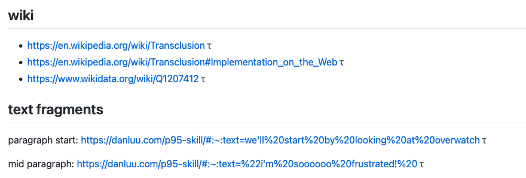
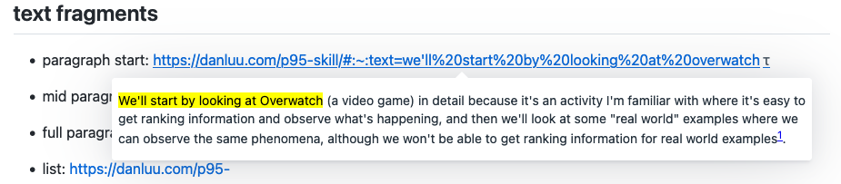

# Transclude Me Extension 

Make web more context rich by enabling in-place context-specific previews for links.

Supported link types:

- [Text fragment links](https://web.dev/text-fragments/)
- Wikipedia links
- iFrame preview for a set of [whitelisted domains](./source/rendering/iframe-renderer.tsx)

You can see how a variety of links are handled by looking
at [test page](https://gist.github.com/Stvad/315bc3ce22b44af7ac71bbfbcaff9777) while using this
extension.

## Usage

After installing the extension - supported links should get a `τ` indicator suffix to signify that
this link has a preview.

To see the preview for a link, hover over the link with the `Alt` key pressed.

## Development

[link-webext-polyfill]: https://github.com/mozilla/webextension-polyfill

[link-options-sync]: https://github.com/fregante/webext-options-sync

### 🛠 Build locally

1. Checkout the copied repository to your local machine eg.
   with `git clone git@github.com:transclude-me/extension.git`
1. Run `yarn` to install all required dependencies
1. Run `yarn build:firefox` to build the extension with manifest v2

The build step will create the `build/<browsername>` folder, this folder will contain the generated
extension.

### 🏃 Run the extension

Using [web-ext](https://extensionworkshop.com/documentation/develop/getting-started-with-web-ext/)
is recommened for automatic reloading and running in a dedicated browser instance. Alternatively you
can load the extension manually (see below).

1. Run `yarn watch:firefox` or `yarn watch:chrome` to watch for file changes and build continuously
1. Run `npm install --global web-ext` (only for the first time)
1. In another terminal,
   run `web-ext run -s build/firefox -f https://gist.github.com/Stvad/315bc3ce22b44af7ac71bbfbcaff9777` for Firefox
   or `web-ext run -s build/chrome -t chromium -f https://gist.github.com/Stvad/315bc3ce22b44af7ac71bbfbcaff9777`
   for Chrome

#### Manually

You can
also [load the extension manually in Chrome](https://www.smashingmagazine.com/2017/04/browser-extension-edge-chrome-firefox-opera-brave-vivaldi/#google-chrome-opera-vivaldi)
or [Firefox](https://www.smashingmagazine.com/2017/04/browser-extension-edge-chrome-firefox-opera-brave-vivaldi/#mozilla-firefox)
.

Note: Firefox will automatically reload content scripts when the extension is updated, Chrome
requires you to reload the page to reload the content scripts.

### Infrastructure

- [link-summoner library](https://github.com/Stvad/link-summoner) that allows you to add live previews to any website
- [Parcel’s Web Extension transformer documentation](https://parceljs.org/recipes/web-extension/)
- Options are managed by [fregante/webext-options-sync][link-options-sync], which auto-saves and
  auto-restores the options form, applies defaults and runs migrations.
- Use modern promise-based `browser.*` APIs [webextension-polyfill][link-webext-polyfill].
- [Chrome extensions’ API list](https://developer.chrome.com/docs/extensions/reference/)

#### Parcel 2

Being based on Parcel 2 and
its [WebExtension transformer](https://parceljs.org/recipes/web-extension/), you get all the good
parts:

- Browserlist-based code transpiling (which defaults to just the latest Chrome and Firefox versions)
- Automatically picks up any new file specified in `manifest.json`
